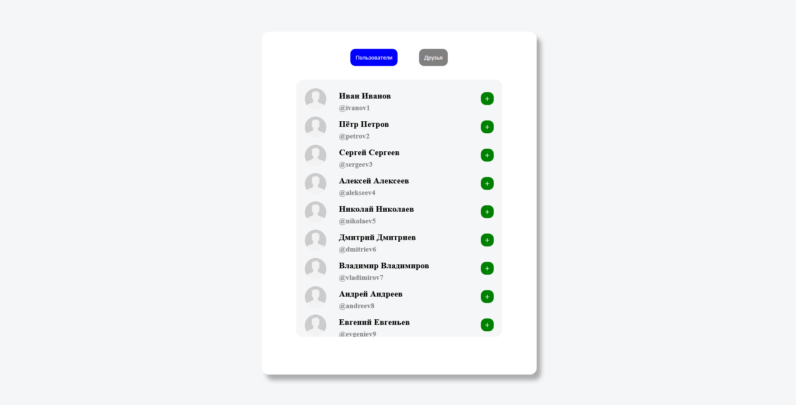
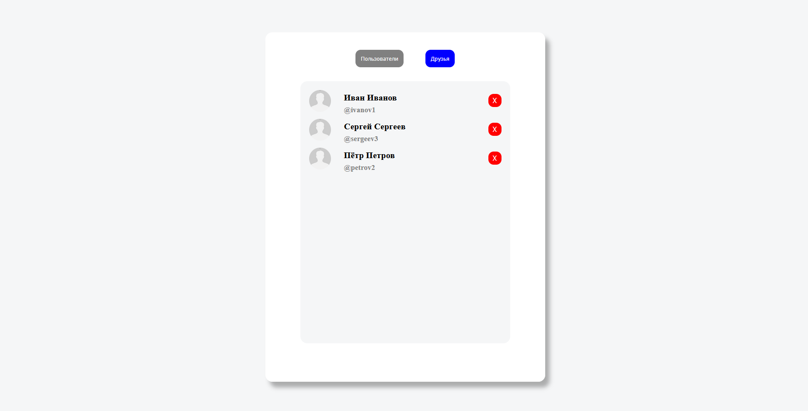

# 🎨 Список пользователей

Веб-приложение на React + TypeScript + Redux, предназначенное для работы со списком пользователей. Приложение позволяет просматривать всех доступных пользователей, добавить в друзья и отслеживать кто из пользователей является другом. 

---

## 🚀 Используемый стек

  

---

## 🖼️ Превью pet проекта

Ссылка - https://shamitsu212.github.io/React_UserList

 
 

---
